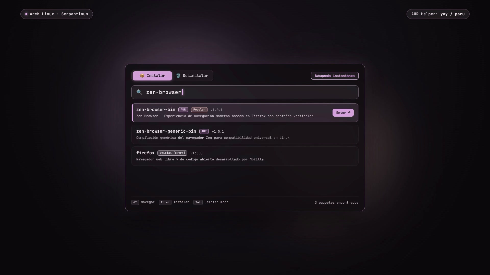

# 📦 AUR Installer GUI (Serpantinum Aesthetic)

<p align="center">
  
</p>

<p align="center">
  <b>AUR Installer GUI</b>: un lanzador flotante minimalista para Arch Linux con estética Serpantinum, animaciones fluidas y búsqueda instantánea en AUR.
  <br>
  <i>Diseñado con Python y QML para ser 100% universal en Arch, CachyOS, EndeavourOS y Omarchy, con feedback táctil y efectos de sonido nativos. 📦✨</i>
</p>

<p align="center">
  <a href="assets/media/demo.mp4">
    
  </a>
  <a href="CHANGELOG.md">
    
  </a>
  <a href="https://archlinux.org">
    
  </a>
  <a href="https://qt.io">
    
  </a>
</p>

---

## 🎬 Demostración en Video

<video src="https://github.com/user-attachments/assets/9313fb0e-e391-459b-a887-811f5ed8bc99" controls width="100%">    </video>

> Podrás apreciar la fluidez de la ventana flotante estilo spotlight, la animación elástica de caracteres (*bouncy pop-in*), la selección con morphing y los efectos de sonido táctiles sincronizados en tiempo real.

---

## ✨ Características Principales

- 🔍 **Búsqueda Natural e Inteligente en AUR y Pacman**:
  - Tolera búsquedas con espacios (`google chrome`), nombres con guiones (`google-chrome`) o palabras separadas.
  - **Algoritmo de relevancia ponderada**: da prioridad máxima a coincidencias exactas, palabras clave y paquetes con alta popularidad/votos en la comunidad de AUR (Google Chrome, VS Code, Spotify), penalizando paquetes de idioma o depuración.
- 🗑️ **Pestaña de Desinstalador de Aplicaciones**:
  - Lista y filtra en tiempo real las aplicaciones instaladas explícitamente (`pacman -Qe`), destacando paquetes de AUR y repositorios de usuario junto a su tamaño en disco.
- 🎨 **Estética Serpantinum / Frosted Glass**:
  - Ventana flotante centrada con esquinas redondeadas y fondo translúcido tipo vidrio esmerilado.
  - Animación elástica de rebote (*bouncy pop-in*) para cada carácter tecleado.
  - Cursor suave animado y barra de selección con efecto *morphing*.
- 🔊 **Efectos de Sonido Táctiles Integrados**:
  - Sonidos incluidos directamente dentro del repositorio (autónomos, sin requerir dependencias externas).
  - Feedback sonoro al teclear (`type.wav`), alternar pestañas (`switch.wav`), hacer clic (`click.wav`) y finalizar instalaciones (`Progress.wav`).
  - Soporte automático para `pw-play` (PipeWire), `paplay` (PulseAudio) y `aplay` (ALSA).
- 🖥️ **Soporte Universal de Escritorios y Terminales**:
  - Funciona de forma nativa en **KDE Plasma, GNOME, Hyprland, Sway, Niri y XFCE**.
  - Respeta el estándar `xdg-terminal-exec` y detecta automáticamente emuladores como **Kitty, Alacritty, Ghostty, Konsole, Foot, GNOME Terminal, Ptyxis**, etc.
- ⚡ **Helper AUR Automático**:
  - Detecta y utiliza de forma transparente `yay` o `paru`.
- 🛡️ **Seguridad y Comodidad (sudoers)**:
  - Opción durante la instalación para configurar una regla segura en `sudoers (NOPASSWD: /usr/bin/pacman)` que agiliza las instalaciones sin pedir clave continuamente.
- 🔄 **Actualizador Inteligente con Verificación de Versión**:
  - Incluye `update.sh` que compara la versión instalada vs. la versión remota en GitHub mediante `CHANGELOG.md` y actualiza en segundos conservando todos tus atajos.

---

## ⌨️ Atajos y Navegación

| Tecla / Acción | Descripción |
| :--- | :--- |
| **`Atajo asignado`** | Abre el menú flotante en el centro de la pantalla |
| **`Tab`** | Alterna suavemente entre el modo **📦 Instalar** y **🗑️ Desinstalar** |
| **Escribir** | Búsqueda y filtrado en tiempo real con sonidos táctiles |
| **`↓` / `↑`** | Navega por la lista con selección deslizante animada |
| **`Enter`** (o clic) | Abre la terminal centrada e inicia la instalación o desinstalación |
| **`Esc`** | Cierra la ventana inmediatamente |

---

## 🚀 Instalación Rápida

```bash
git clone https://github.com/LMNoriega/aur-installer-gui.git
cd aur-installer-gui
./install.sh
```

El script interactivo:
1. Comprueba e instala dependencias faltantes (Python, PyQt6, helper AUR).
2. Instala ejecutables, interfaz QML, assets y lanzador `.desktop`.
3. Detecta tu entorno de escritorio (**KDE Plasma, GNOME, Hyprland**, etc.) y configura el atajo óptimo sin colisiones.

---

## 🔄 Actualización Automática

Para actualizar a la última versión en cualquier momento:

```bash
./update.sh
```

El actualizador:
- Compara tu versión local con la última versión de GitHub en [`CHANGELOG.md`](CHANGELOG.md).
- Si hay una versión más nueva, sincroniza el repositorio y actualiza los binarios y recursos.
- **Conserva intactos tus atajos de teclado y configuraciones existentes.**

---

## ⚙️ Configuración de Atajos por Entorno

### 🔵 KDE Plasma (CachyOS / Arch)
> ⚠️ **Nota:** En KDE Plasma, `Super + I` abre las Preferencias del Sistema.
> El instalador sugiere usar **`Meta + Shift + A`** o **`Meta + A`**.
> Puedes gestionarlo en: **Preferencias del Sistema > Accesos rápidos > Accesos rápidos personalizados > Instalador AUR**.

### 🟠 Hyprland
En tus atajos (`~/.config/hypr/bindings.lua` o `keybinds.lua`):
```lua
hl.bind("SUPER + I", hl.dsp.exec_cmd("aur-search-gui"))
```

En tus reglas de ventana (`~/.config/hypr/settings.lua` o `hyprland.conf`):
```lua
hl.window_rule({
  name = "aur-installer-gui",
  match = { class = "aur-installer-gui" },
  float = true,
  center = true,
  size = { 740, 560 },
})

hl.window_rule({
  name = "aur-installer-term",
  match = { class = "aur-installer-term" },
  float = true,
  center = true,
  size = { 900, 600 },
})
```

### 🟣 GNOME
En **Configuración > Teclado > Ver y personalizar atajos > Atajos personalizados**:
- **Nombre:** `Instalador AUR`
- **Comando:** `aur-search-gui`
- **Atajo:** `<Super><Shift>A`

### 🟢 Sway / i3
En `~/.config/sway/config`:
```i3config
bindsym $mod+Shift+a exec aur-search-gui
```

### 🟡 Niri
En `~/.config/niri/config.kdl`:
```kdl
binds {
    Mod+Shift+A { spawn "aur-search-gui"; }
}
```

---

## 📄 Estructura del Repositorio

```
aur-installer-gui/
├── assets/
│   ├── media/               # Video de demostración, capturas y textos
│   │   ├── demo.mp4         # Video de presentación en 1080p
│   │   ├── preview.jpg      # Captura de pantalla en alta resolución
│   │   └── share-copy.txt   # Texto descriptivo y promocional
│   └── sounds/              # Efectos de sonido incluidos (independientes)
├── bin/
│   ├── aur-search-gui       # Backend y frontend QtQuick/QML
│   └── aur-installer-run    # Ejecutor en terminal (soporte yay/paru)
├── qml/
│   └── Main.qml             # Interfaz QML completa
├── desktop/
│   └── aur-installer-gui.desktop
├── sudoers/
│   └── 10-aur-installer     # Regla NOPASSWD para pacman
├── CHANGELOG.md             # Control de versiones y novedades
├── install.sh               # Instalador interactivo universal
├── update.sh                # Actualizador rápido
└── README.md
```

---

## 👤 Autor
- **Lucas Noriega** - [@LMNoriega](https://github.com/LMNoriega)
